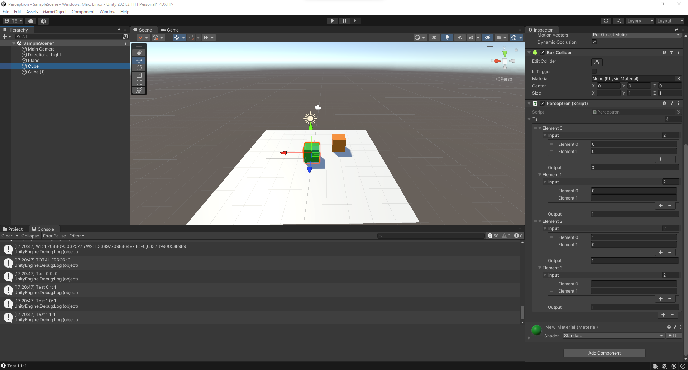
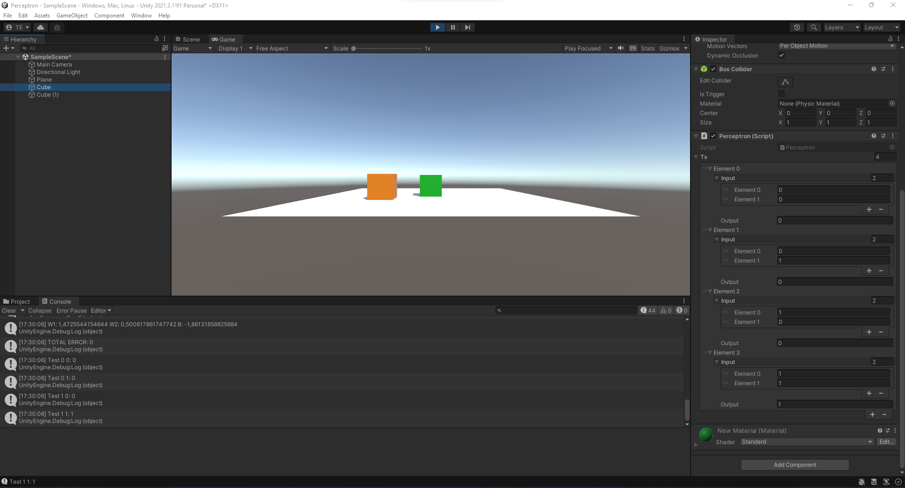
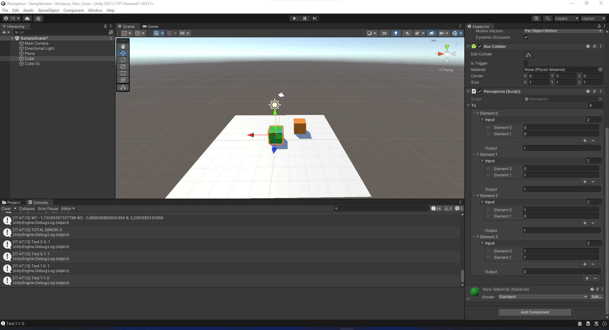
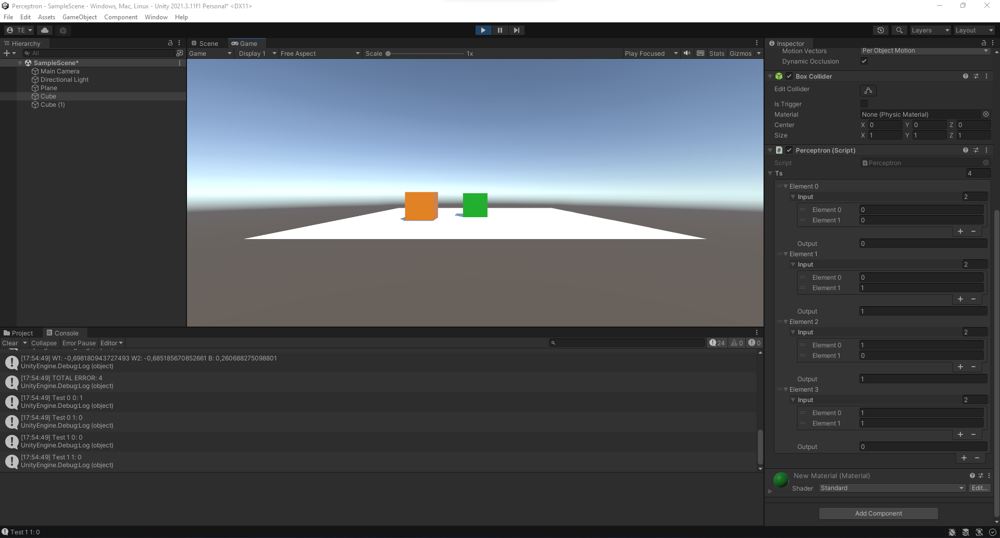
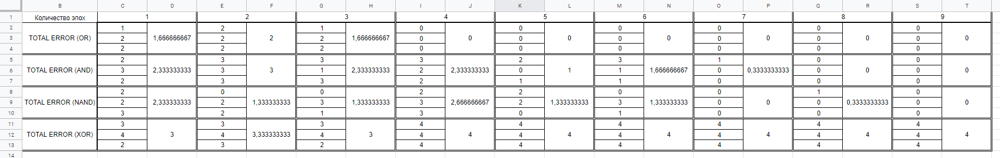
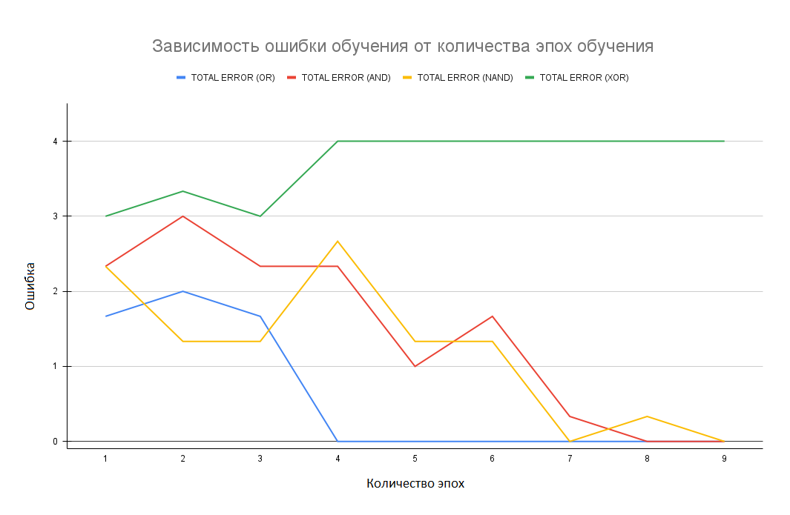
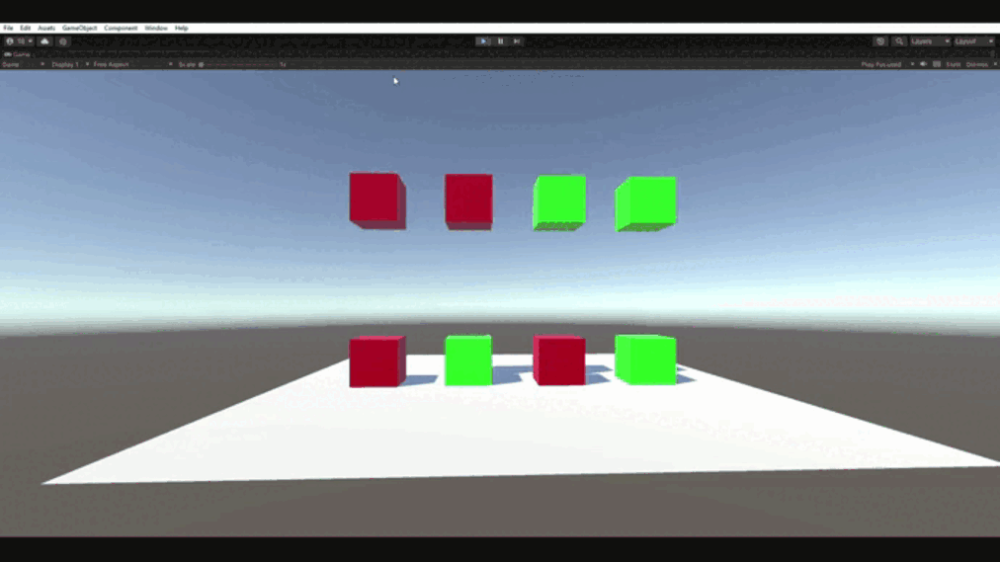

# АНАЛИЗ ДАННЫХ И ИСКУССТВЕННЫЙ ИНТЕЛЛЕКТ [in GameDev]
Отчет по лабораторной работе #4 выполнил:
- Ельмуратов Темирлан Кеулимжаевич
- РИ-210913

Отметка о выполнении заданий (заполняется студентом):

| Задание | Выполнение | Баллы |
| ------ | ------ | ------ |
| Задание 1 | * | 60 |
| Задание 2 | * | 20 |
| Задание 3 | * | 20 |

знак "*" - задание выполнено; знак "#" - задание не выполнено;

Работу проверили:
- к.т.н., доцент Денисов Д.В.
- к.э.н., доцент Панов М.А.
- ст. преп., Фадеев В.О.

[](https://nodesource.com/products/nsolid)

[](https://travis-ci.org/joemccann/dillinger)

Структура отчета

- Данные о работе: название работы, фио, группа, выполненные задания.
- Цель работы.
- Задание 1.
- Код реализации выполнения задания. Визуализация результатов выполнения (если применимо).
- Задание 2.
- Код реализации выполнения задания. Визуализация результатов выполнения (если применимо).
- Задание 3.
- Код реализации выполнения задания. Визуализация результатов выполнения (если применимо).
- Выводы.
- ✨Magic ✨

## Цель работы
Познакомиться с Перцептроном, применить его в проекте Unity.

## Задание 1
### В проекте Unity реализовать перцептрон, который умеет производить вычисления (OR, AND, NAND, XOR) и дать комментарии о корректности работы

Создал проект в Unity, поместил в сцену объект и навесил на него скрипт Perceptron:

```cs
using System.Collections;
using System.Collections.Generic;
using UnityEngine;

[System.Serializable]
public class TrainingSet
{
	public double[] input;
	public double output;
}

public class Perceptron : MonoBehaviour {

	public TrainingSet[] ts;
	double[] weights = {0,0};
	double bias = 0;
	double totalError = 0;

	double DotProductBias(double[] v1, double[] v2) 
	{
		if (v1 == null || v2 == null)
			return -1;
	 
		if (v1.Length != v2.Length)
			return -1;
	 
		double d = 0;
		for (int x = 0; x < v1.Length; x++)
		{
			d += v1[x] * v2[x];
		}

		d += bias;
	 
		return d;
	}

	double CalcOutput(int i)
	{
		double dp = DotProductBias(weights,ts[i].input);
		if(dp > 0) return(1);
		return (0);
	}

	void InitialiseWeights()
	{
		for(int i = 0; i < weights.Length; i++)
		{
			weights[i] = Random.Range(-1.0f,1.0f);
		}
		bias = Random.Range(-1.0f,1.0f);
	}

	void UpdateWeights(int j)
	{
		double error = ts[j].output - CalcOutput(j);
		totalError += Mathf.Abs((float)error);
		for(int i = 0; i < weights.Length; i++)
		{			
			weights[i] = weights[i] + error*ts[j].input[i]; 
		}
		bias += error;
	}

	double CalcOutput(double i1, double i2)
	{
		double[] inp = new double[] {i1, i2};
		double dp = DotProductBias(weights,inp);
		if(dp > 0) return(1);
		return (0);
	}

	void Train(int epochs)
	{
		InitialiseWeights();
		
		for(int e = 0; e < epochs; e++)
		{
			totalError = 0;
			for(int t = 0; t < ts.Length; t++)
			{
				UpdateWeights(t);
				Debug.Log("W1: " + (weights[0]) + " W2: " + (weights[1]) + " B: " + bias);
			}
			Debug.Log("TOTAL ERROR: " + totalError);
		}
	}

	void Start () {
		Train(8);
		Debug.Log("Test 0 0: " + CalcOutput(0,0));
		Debug.Log("Test 0 1: " + CalcOutput(0,1));
		Debug.Log("Test 1 0: " + CalcOutput(1,0));
		Debug.Log("Test 1 1: " + CalcOutput(1,1));		
	}
	
	void Update () {
		
	}
}

```


— OR

Перцептрон научился выполнять операцию OR уже на 4 эпохе обучения.



— AND

Обучение операции AND можно было считать успешным на 7 эпохе, однако, во время проверки на 8 эпохе обучения всё-таки появилась ошибка. Поэтому, считаем обучение завершённым к 9 эпохе. (результаты тестов представлены в задании №2)



— NAND

Обучение также успешно завершилось к 8 эпохе.



— XOR

Перцептрон не научился выполнять операцию XOR даже при 100 000 эпох обучения. Следовательно, перцептрон не способен выполнять данную операцию.




## Задание 2
### Построить графики зависимости количества эпох от ошибки обучения. Указать от чего зависит необходимое количество эпох обучения.

Для большей точности для каждой эпохи провёл по три итерации, затем вычислил средние значения ошибки и составил по ним график.





Глядя на результаты обучения операции NAND, делаем вывод, что даже если на какой-то эпохе перцептрон удачно выполнил задачу, лучше взять чуть больше эпох обучения для избежания появления редких ошибок.

Необходимое количество эпох обучения напрямую зависит от ошибки (если Перецептрон способен решать эту задачу), полученной при первой эпохе обучения, чем больше ошибка - тем больше эпох потребуется для обучения.

## Задание 3
### Построить визуальную модель работы перцептрона на сцене Unity.


Добавил в скрипт Perceptron метод OnCollisionEnter, который определяет цвета столкнувшихся объектов, по которым определяет результирующий цвет объекта `красный - falce`, `зелёный - true`
```cs
    void OnCollisionEnter(Collision other)
    {
        var firstInput = this.gameObject.GetComponent<Renderer>().material.color == Color.green ? 1 : 0;

        var secondInput = other.gameObject.GetComponent<Renderer>().material.color == Color.green ? 1 : 0;

        var resultColor = CalcOutput(firstInput, secondInput) == 0 ? Color.red : Color.green;

        this.gameObject.GetComponent<Renderer>().material.color = resultColor;

        Destroy(other.gameObject);
    }
```

Для работы коллизии отключил у всех кубов параметр Box Collider —> Is Trigger, и, наоборот, включил его для плоскости. Также верхним кубам добавил компонент Rigidbody.

Визуализировал логические операции:

OR



AND


Nand


XOR не визуализировал, т.к. эта операция неподвластна Перцептрону.

## Выводы

В ходе этой лабораторной работы я познакомился с такой математической моделью, как Перцептрон, с помощью него в Unity реализовал логические операции OR, AND, NAND, а также узнал, что Перцептрон не способен выполнять операцию XOR. А также визуализировал работу Перцептрона в Unity.
